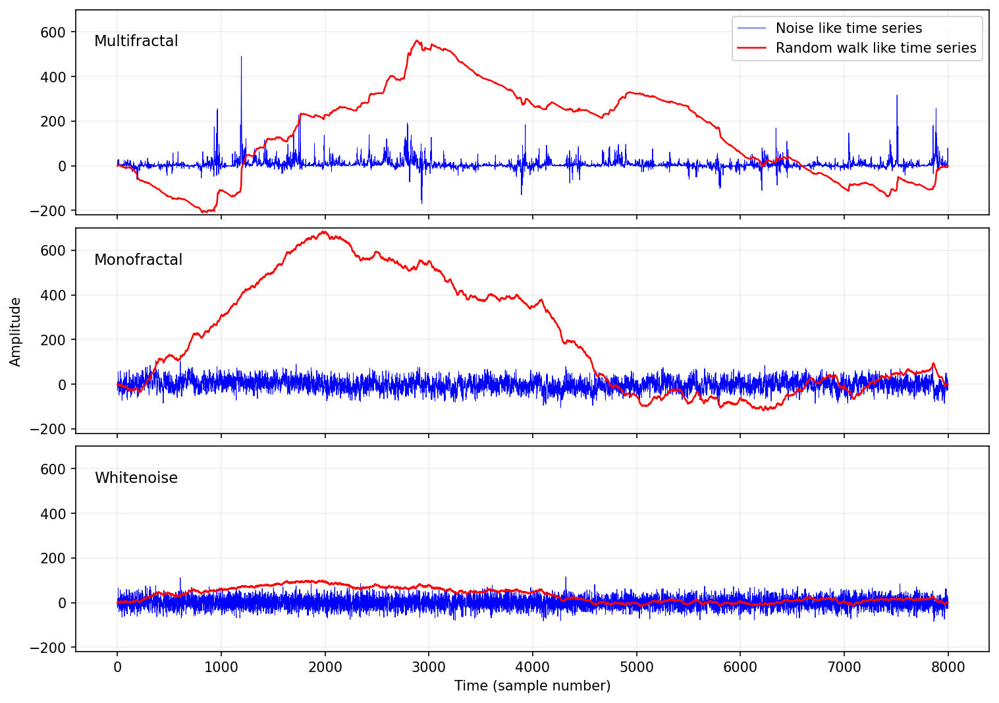
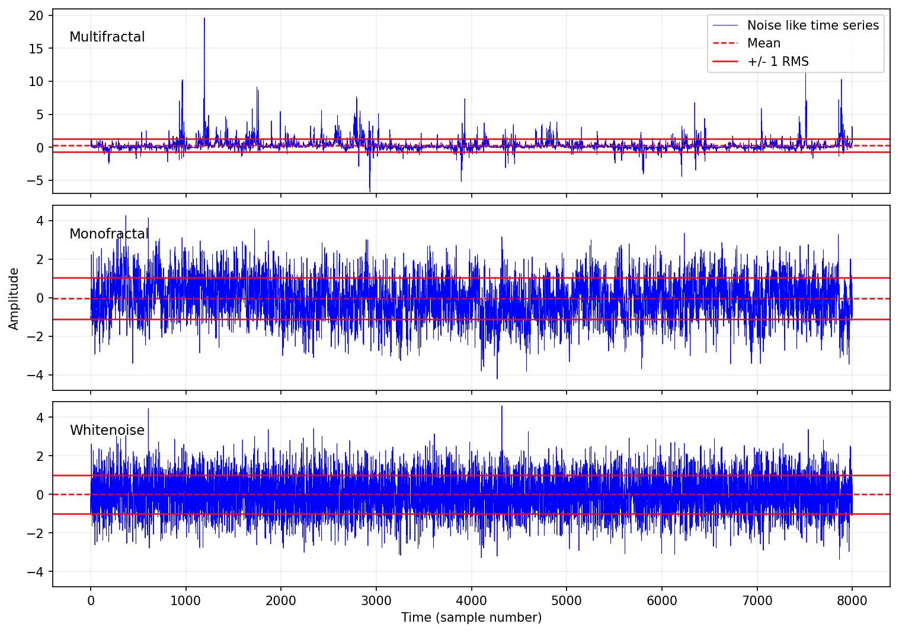
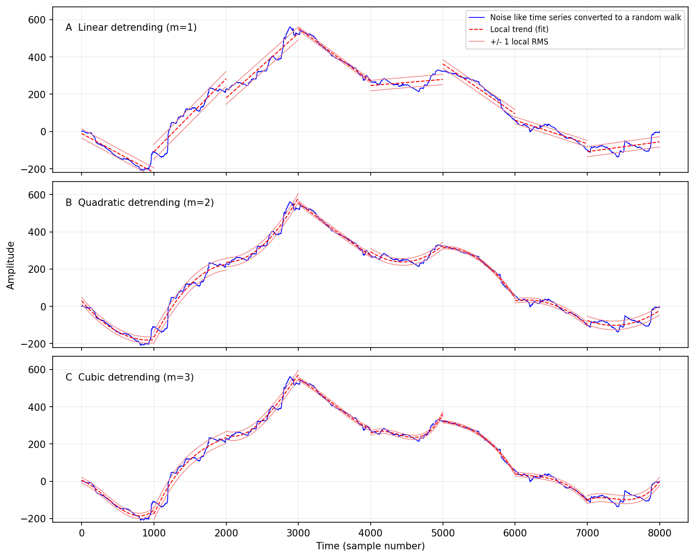
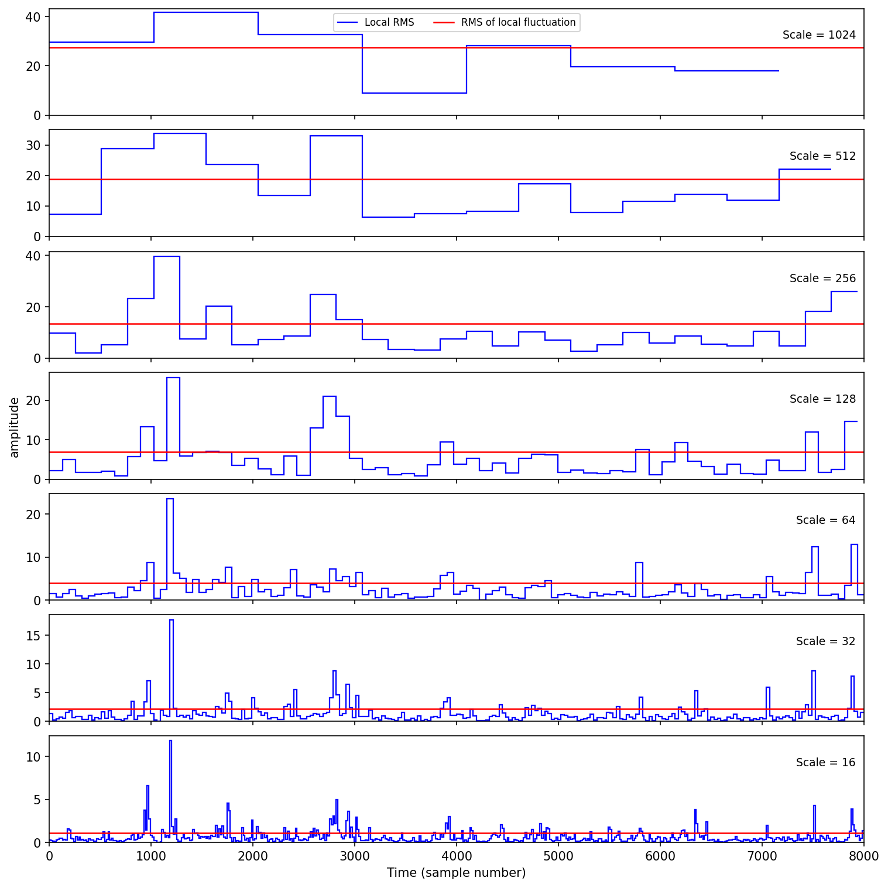
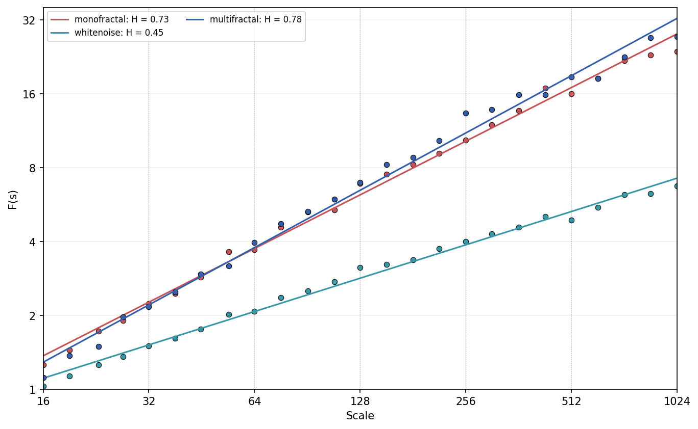
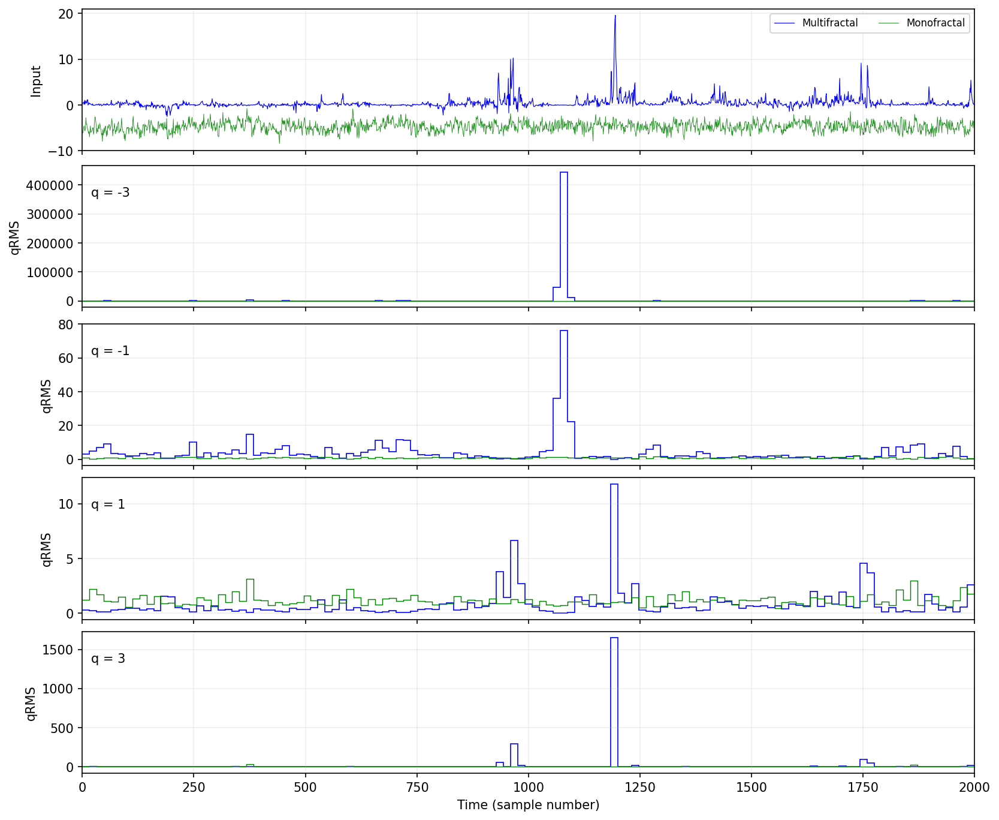
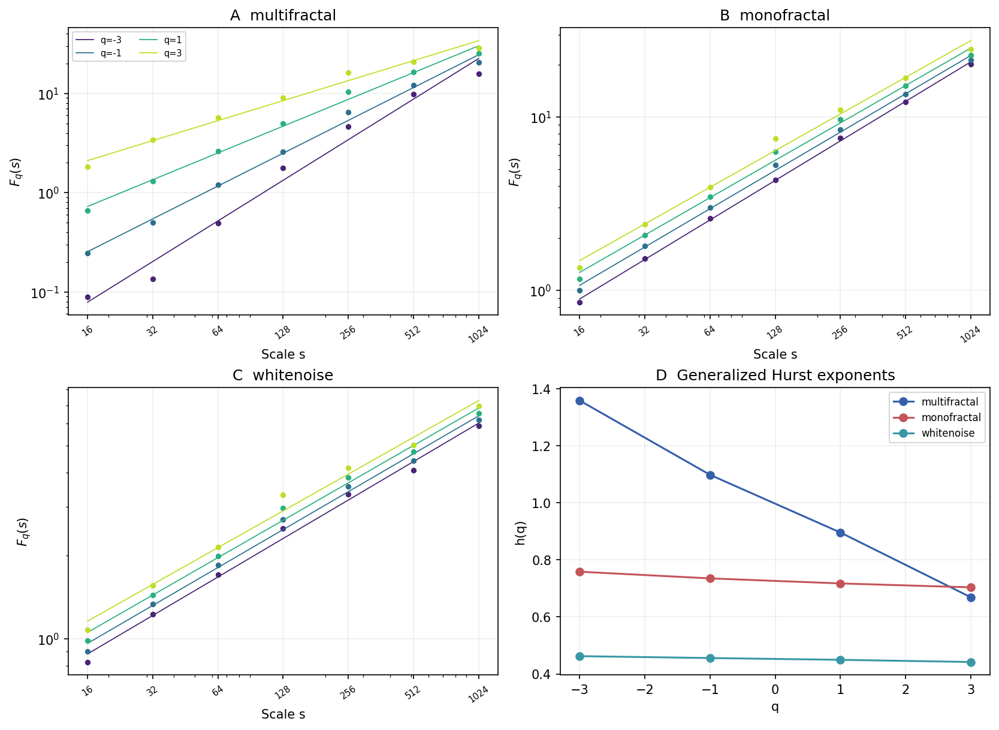
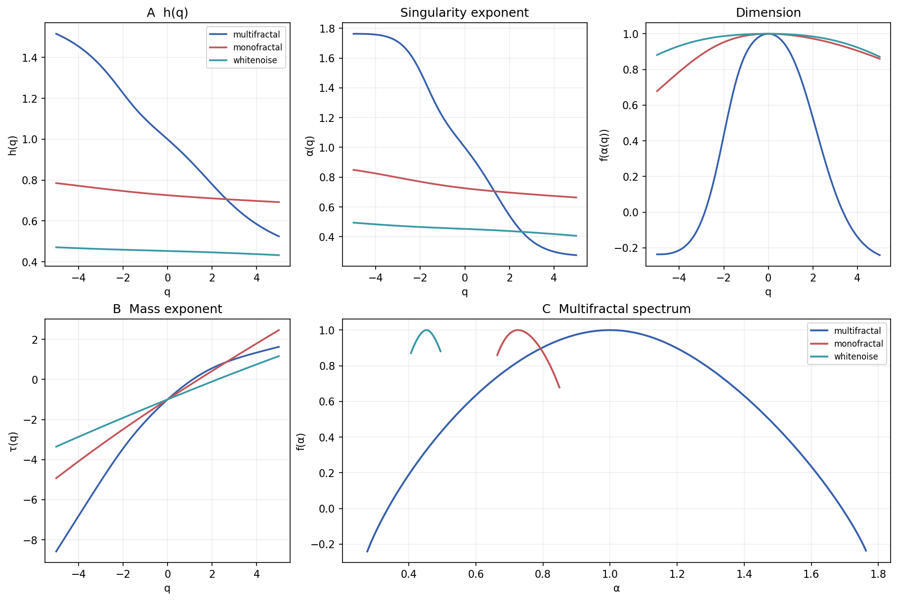
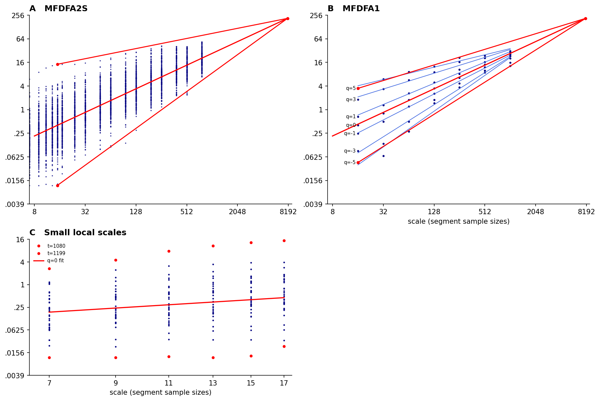
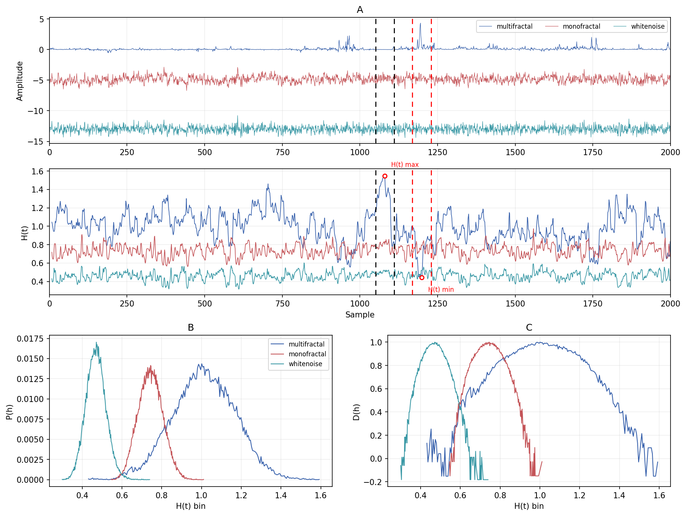

# MFDFA — Multifractal Detrended Fluctuation Analysis in Python

A NumPy/SciPy reimplementation of the MATLAB tutorial in Ihlen (2012).

## Reference

Ihlen EAF (2012). *Introduction to Multifractal Detrended Fluctuation Analysis in
Matlab.* Front. Physiol. 3:141. doi:
[10.3389/fphys.2012.00141](https://www.frontiersin.org/journals/physiology/articles/10.3389/fphys.2012.00141/full)

## Figures

